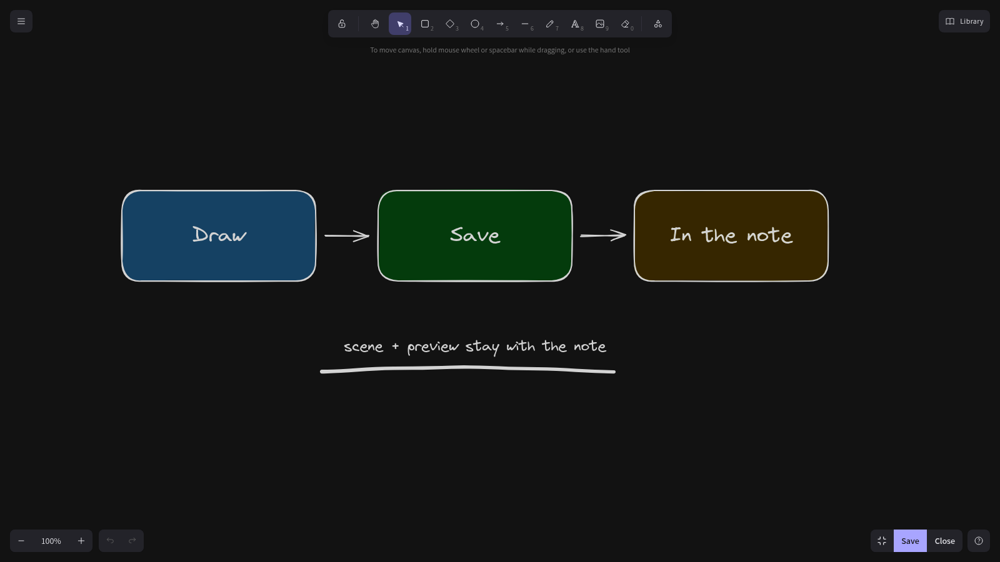
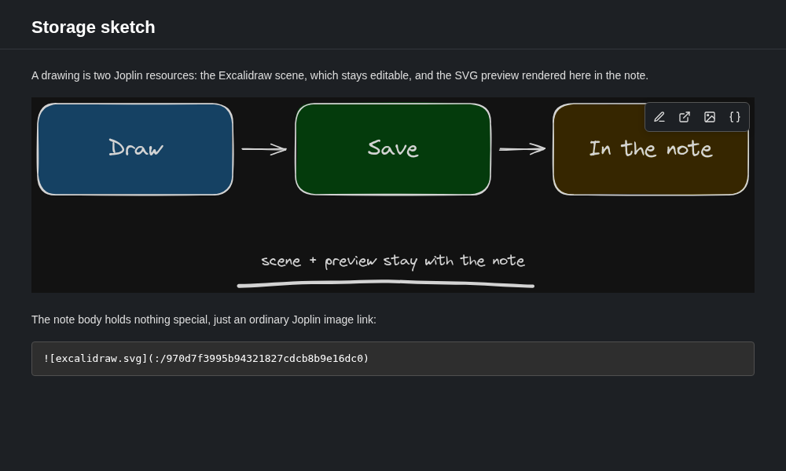
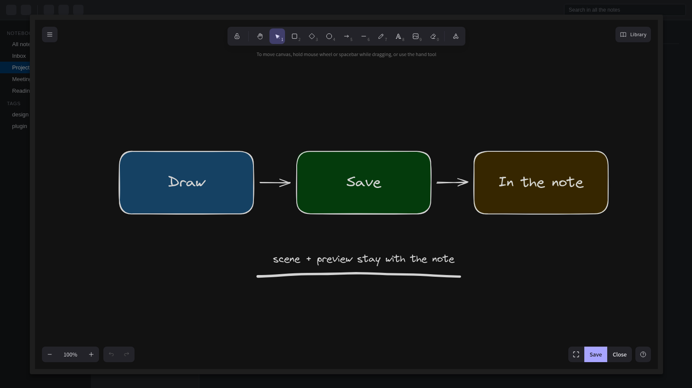

# Excalidraw

[Excalidraw](https://github.com/excalidraw/excalidraw) drawings in your Joplin notes: draw, edit,
copy and share hand-drawn sketches and diagrams without leaving Joplin.



## Features

- **Create a drawing** from the editor toolbar, the Tools menu or the right-click menu.
- **Edit it anywhere** — a hover toolbar in the Markdown viewer, the context menu in the Markdown
  editor, a double-click in the Rich Text editor.
- **A full-size editor** that fills the Joplin window, or Joplin's normal dialog size. Your choice
  is remembered.
- **Edit in a new window**, so you can read or type in the note while you draw.
- **Copy as image** — a PNG on the clipboard, rasterised at 2× for HiDPI screens.
- **Copy as JSON** — paste editable elements into excalidraw.com, Obsidian or another drawing.
- **Light and dark theme**, following Joplin's own.
- **Saved drawings refresh in place**, in every open window.

## Editing

### Creating a drawing

Click the pencil button on the editor toolbar, draw, and close the dialog. The drawing is inserted
at the cursor as a normal image.

### The hover toolbar

Hover a drawing in the Markdown viewer and a small island appears in its top-right corner with four
buttons:

- ✏️ **Edit drawing** — opens the editor.
- ↗️ **Edit drawing in a new window** — see below.
- 🖼️ **Copy drawing as image** — see [Copying](#copying).
- `{}` **Copy as JSON** — see [Copying](#copying).



In the **Rich Text editor** and in HTML notes nothing is injected (the extra markup would be saved
into the note, or would always be visible) — **double-click** a drawing to edit it there.

### Right-click and the Tools menu

Put the cursor on the line holding a drawing in the **Markdown editor** and right-click: the same
four actions appear at the bottom of the editor's context menu. They only show up when the current
line actually holds a drawing.

**Tools → Excalidraw** groups every command in one submenu: *Add Excalidraw drawing*, *Edit
Excalidraw drawing*, *Edit Excalidraw drawing in new window*, *Copy Excalidraw drawing as image*,
*Copy Excalidraw drawing as JSON*. From the menu they act on the drawing on the cursor's line, then
the selection, then the note's only drawing.

### Save, Close and full size

The bottom right of the canvas holds one small bar with **Save**, **Close** and a full-size toggle,
instead of Joplin's button band under the dialog — in both sizes, and out of the way of Excalidraw's
own toolbars. *Escape* still closes the editor too.

The toggle next to *Save* expands the editor to the whole Joplin window and back — no margin round
the drawing. The last choice is remembered, and the *Open the editor full size* setting decides how
the editor opens the first time.



### Saving

Saving a drawing refreshes its image in place, so you see the new version without reopening the
note — in **every** window. A window that was not the one you saved from catches up as soon as you
click back into it, and an image that happened to load while Joplin was rewriting the drawing's file
retries itself instead of staying a broken icon.

### Editing in a new window

*Edit in a new window* opens the note in a second Joplin window and puts the editor there, so you
can read or type in the note while you draw. **Existing drawings only** — a new drawing has to
insert a link into the note body, and the first window would overwrite it. Two different drawings
can be open at once; the same drawing can only be open in one editor.

> [!WARNING]
> Close the editor with its own **Close** button (or *Escape*), not the window's title bar. Joplin
> gives a plugin no notice when a window is closed, so closing the *window* loses any unsaved
> changes.

If the editor ever opens in the wrong window, Joplin lost the focus race: open the note in a new
window yourself (**Note → Open in new window**) and click **Edit** there — that is always
deterministic, because the focus is yours.

## Copying

### As an image

*Copy as image* puts a PNG on the clipboard, ready to paste into a chat, a mail or another app.
Joplin's own *Copy image* works in the viewer but does nothing for a drawing in the Markdown
editor — it decodes the resource with Electron's native image code, which cannot read SVG
([joplin#15878](https://github.com/laurent22/joplin/issues/15878)) — so the plugin rasterises the
drawing itself, at 2× for crisp pasting on HiDPI screens. Dark drawings copy dark.

### As JSON

*Copy as JSON* puts the drawing on the clipboard as text, in Excalidraw's own clipboard format —
the JSON Excalidraw itself writes when you copy elements. Paste it into
[excalidraw.com](https://excalidraw.com), into Obsidian's Excalidraw plugin, or into another drawing
here, and you get **editable elements** — movable, editable shapes — not a picture of them. Images
inside the drawing travel with it.

## Settings

Three settings under **Tools → Options → Excalidraw**:

- **Theme for new drawings** — Follow Joplin theme (default), Light, or Dark.
- **Keep each drawing's saved theme** — on by default. When off, existing drawings also open using
  the *Theme for new drawings* setting.
- **Open the editor full size** — on by default. Decides how the editor opens before you use the
  size toggle yourself.

## How drawings are stored

Each drawing is two Joplin resources:

- a **`.json`** resource — the Excalidraw scene, the editable source;
- an **`.svg`** resource — the preview that Joplin renders in the note.

The note body itself holds nothing special, just an ordinary Joplin image link:

```

```

The two resources are paired by their titles (`excalidraw-<json resource id>.json` and
`excalidraw-<json resource id>.svg`), so the drawing survives sync and export like any other
attachment.

## Coming from joplin-excalidraw-v2 or joplin-excalidraw

This plugin is the continuation of [`joplin-excalidraw-v2`](https://github.com/neagix/joplin-excalidraw-v2)
by neagix, which is no longer maintained (last commit October 2025), itself a fork of
[`joplin-excalidraw`](https://github.com/artikell/joplin-excalidraw) by artikell.

> [!IMPORTANT]
> **Disable or uninstall the old plugin first.** Your drawings are ordinary note attachments,
> not something a plugin owns, so disabling or removing a plugin never touches them. With both
> plugins enabled you get two sets of buttons on every drawing, two pencil buttons on the toolbar
> and two Tools → Excalidraw submenus — and because Joplin does not namespace content-script
> ids, an Edit click can be handled by the *other* plugin's editor.

- **Your existing drawings keep working.** Both the `` links and the
  `excalidraw-<id>.json` / `.svg` resource pairs are read unchanged. Nothing is converted or
  rewritten on install.
- **Drawings from the original v1 plugin** (``) still show a
  **Convert to v2 🔄** button. The converted copy starts with a placeholder preview — open it
  once and save to get a real one. The original v1 resource is left untouched, so other notes
  referencing it are unaffected.
- **Settings start at their defaults.** Joplin stores plugin settings under the plugin's id, so
  the new id starts fresh: *Follow Joplin theme*, *Keep each drawing's saved theme* and *Open the
  editor full size*. Three settings, ten seconds to redo.

## Development

See [GENERATOR_DOC.md](./GENERATOR_DOC.md) for the code generation instructions.

```sh
npx yarn@1.22.22 install
npm run dist
```

`npm run dist` writes the release package to `publish/` (a `.jpl` archive and its manifest
`.json`).

For development you can point Joplin straight at the build output: `Tools` → `Options` →
`Plugins` → `Show advanced settings`, and add this repository's `dist/` directory.

## Credits

> [!CAUTION]
> Not compatible with the Freehand Drawing plugin, it causes glitches when both are enabled.

- Original plugin by [artikell](https://github.com/artikell/joplin-excalidraw); v2 by
  [neagix](https://github.com/neagix/joplin-excalidraw-v2).
- Thanks to [@Winbee](https://github.com/Winbee) for the Vite refactor.
- Thanks to [@smallzh](https://github.com/smallzh) for the SVG preview support.
- This project refers to the [ThibaultJanBeyer/joplin-sheets](https://github.com/ThibaultJanBeyer/joplin-sheets)
  project, thank you.
- Thanks to [@Akiyamka](https://github.com/Akiyamka) for testing.
- The [Excalidraw](https://github.com/excalidraw/excalidraw) library is bundled into the plugin
  (MIT, Copyright (c) 2020 Excalidraw), together with its fonts and assets; the fonts are covered
  by their own licences.
